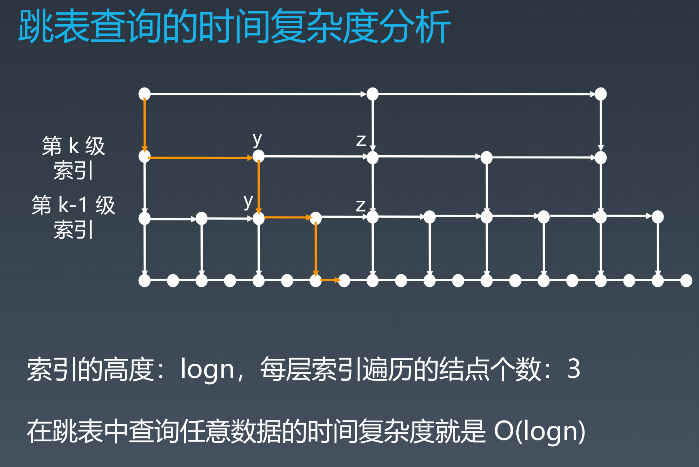

https://www.processon.com/view/link/5f047f5ee401fd3908b81a75

## 跳表

>  只能用于元素有序的情况

对标平衡树和二分查找，插入/删除/搜索 都是 O(log n) 的数据结构（插入、删除需要修改索引）。

https://redisbook.readthedocs.io/en/latest/internal-datastruct/skiplist.html

思路：升维，建立索引，空间换时间



## 栈、队列

```java
		// deque
		Deque<String> deque = new LinkedList<String>();
		deque.addLast("a");
		deque.addLast("b");
		deque.addLast("c");
		System.out.println(deque);
		
		String str = deque.peekFirst();
		System.out.println(str);
		System.out.println(deque);
		
		while (deque.size() > 0) {
			System.out.println(deque.pollFirst());
		}
		System.out.println(deque);
```

### PriorityQueue

插入操作：O(1) ？？*offer: O(logN)*

取出操作：O(logN)-元素优先级 ?? *peek: O(1)*

```java
	/** offer 等调用，向上筛选插入
	* k position
	* x element
	*/
    private void siftUpUsingComparator(int k, E x) {
        // 插入到比x权重相等或次小的位置k的家族位置（k及其祖先元素位置）
        while (k > 0) {
            int parent = (k - 1) >>> 1;
            Object e = queue[parent];
            if (comparator.compare(x, (E) e) >= 0)
                break;
            queue[k] = e;
            k = parent;
        }
        queue[k] = x;
    }

  /** remove 等调用，向下筛选插入
    * k position
    * x element
    */
		private void siftDownUsingComparator(int k, E x) {
      	// 将元素x放在k为始祖的权重家族中
        int half = size >>> 1;
        while (k < half) {
            int child = (k << 1) + 1;
            Object c = queue[child];
            int right = child + 1;
            if (right < size &&
                comparator.compare((E) c, (E) queue[right]) > 0)
                c = queue[child = right];
            if (comparator.compare(x, (E) c) <= 0)
                break;
            queue[k] = c;
            k = child;
        }
        queue[k] = x;
    }
```

